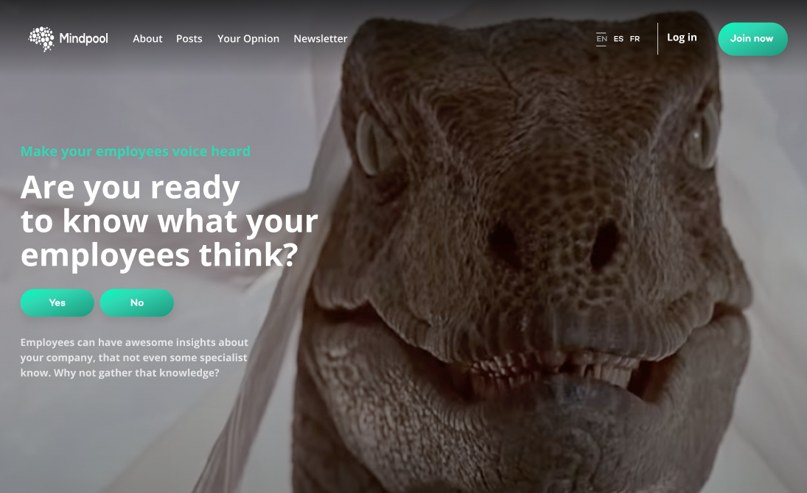

# **Mindpool Landing Page**

## <a href="https://mindpool-lp.vercel.app" target="_blank">DEMO ONLINE</a>

## <a href="https://6147c00b149a1b003a2cad0a-oyxrqimiyy.chromatic.com" target="_blank">StoryBook</a>

 

# **How to run local**

First, you need to clone this repository.

Inside the directory, run in terminal:

    yarn quickstart

Then, open in your browser http://localhost:3000/
 
 

# **Used Technologies**

Next.js | Chakra UI | TypeScript | StoryBook
